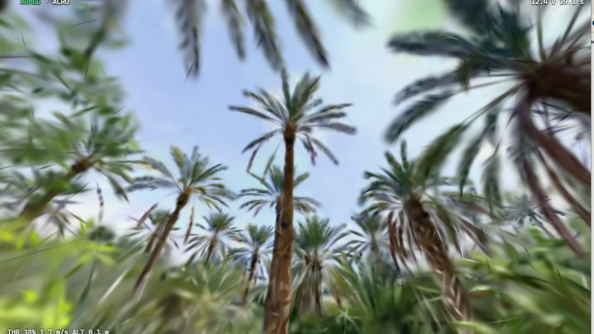

# ShramkoGSFPV — open-source FPV drone simulator for 3D Gaussian Splatting scenes

**Fly a real-feeling FPV drone through photoreal 3D Gaussian Splatting scans, right in your browser.** ShramkoGSFPV loads scenes straight from [SuperSplat](https://superspl.at), flies them with a quadcopter model that has four motors, a mixer, a rate PID and Betaflight-compatible rate curves, crashes you into real walls with swept voxel collision, and takes your own radio (EdgeTX over WebHID), a gamepad or touch sticks. WebGPU, the MIT-licensed PlayCanvas engine, nothing to install. Created by [Andrii Shramko](https://www.linkedin.com/in/andrii-shramko/).

### ▶ Fly now: **https://gsfpv.flyreelstudio.eu**

[](https://gsfpv.flyreelstudio.eu)

> **Status: alpha, live since September 2026.** The site, the simulator and the measurements below run in public. Every feature claim in this README is either **measured** (a JSON file in [`evidence/`](evidence/) with its method) or explicitly marked **not tested yet**. Most pass/fail checks also run a negative control, a deliberately broken case that must fail; where a check has none, or a weak one, the line says so. The radio path has been tested with a *simulated* EdgeTX radio, not yet with a real one.

---

## Why this exists

FPV pilots train in simulators like Liftoff or VelociDrone because the physics and stick response feel right, but those sims only fly the maps someone built for them. Meanwhile people publish thousands of real places as 3D Gaussian Splatting scans — rooms, villas, streets, whole city blocks — and you can only walk or orbit through them.

ShramkoGSFPV joins the two: pick a real scanned place, arm, and fly it with a drone that behaves like the one in your hands. Rehearse an indoor line before flying it for real, plan a cinematic shot in the actual location, or fly your own house on the Moon.

The default craft is a **BetaFPV Pavo20 Pro** class 2.2″ cinewhoop, with five more presets: Pavo20 Pro II on 3S and 4S, Pavo Pico, Meteor65 Pro and Air65. Most scans are rooms and streets, where a 5″ freestyle quad has no room to move. On each preset card the spec rows (thrust-to-weight, weight, wheelbase, motor, battery) say where the number comes from: manufacturer, independent measurement or estimate. The card's maximum rate (°/s) and hover-throttle figures do not carry a source label yet. The thrust-to-weight of three presets (Pavo20 Pro 3S, Pavo20 Pro II 3S, Pavo Pico 2S) was measured in the model and is within 0.4 % of the preset value (`b-fly-b9.json`); the other three are **not measured yet**.

## What is measured (not claimed)

Numbers from the JSON files in [`evidence/2026-09-24/`](evidence/2026-09-24/) named in each row. The landing page's figures come from [`evidence/latest.json`](evidence/latest.json) (rates, tunnelling, clearance, latency), and its build fails if a number is missing.

| Check | Result | How |
|---|---|---|
| Rate curves vs Betaflight 4.5.1 | **1880 points, max error 0 °/s** in double precision | Betaflight's own `rc.c` compiled outside the repo with `float` promoted to `double`, vs our re-implementation; a float32 build differs by at most 6.3e-4 °/s ([`PROVENANCE`](docs/PROVENANCE.md)). A deliberately wrong curve (`x³` instead of `x⁵` in Actual) misses the vectors by up to 280 °/s, so they tell the curves apart (`a3-rates-vectors.json`) |
| Flying through walls (tunnelling) | **0 in 200,000 straight passes** | 1 ms swept test vs an independent resampling oracle at 5–34 m/s on 3 real scans and a 2 cm wall; the endpoint-only control misses walls, so the oracle is not blind (`a5-tunnelling.json`) |
| Determinism | **same SHA-256 of the whole trace** in Node and Chrome and at 30/60/144/240 Hz frame splits | `Math.random` injected into the core changes the hash (`a6-determinism.json`) |
| Replay from stick inputs only | **same hash in a new tab**; 1 LSB changed in one report → different hash and > 1 cm divergence | 30 s flight with a flip and a crash, on the live site (`b-fly-b15.json`) |
| Wall clearance, Pavo20 Pro | body stops **47.2 mm (median)** beyond its own size on 5 cm voxel collision | 200 directions from 12 points; a record, not a gate, so it has no negative control (`a8-clearance.json`) |
| Stick-to-screen latency | **display-limited**: the test screen runs at 30 Hz (median 252 ms, blank-page floor 65 ms) | `SendInput` → Desktop Duplication marker, N = 220, `lagFrames=2` control fires; camera measurement not done yet (`a9-latency.json`) |

## How it works

```
superspl.at link or id ──► CDN: settings.json, lod-meta.json, scene.voxel.{json,bin}
                                   │
┌──────────────┐   ┌───────────────┴──────┐   ┌──────────────────────┐
│ render        │   │ sim-core (no DOM)     │   │ input                 │
│ PlayCanvas    │◄──│ 1 ms fixed step, 4    │◄──│ WebHID (EdgeTX)       │
│ WebGPU, GPU   │   │ motors, mixer, rate   │   │ Gamepad API           │
│ sort, LOD     │   │ PID, BF/Actual/KISS/  │   │ touch sticks          │
│ streaming     │   │ Raceflight rates,     │   │ calibration wizard,   │
└──────────────┘   │ gravity, input log     │   │ arm gate              │
                   └──────────┬────────────┘   └──────────────────────┘
                              ▼
                   ┌──────────────────────┐   ┌──────────────────────┐
                   │ collision             │   │ crash                 │
                   │ voxel octree (vendored│──►│ Rapier wreck, debris,  │
                   │ MIT), swept spheres   │   │ chase camera, respawn  │
                   └──────────────────────┘   └──────────────────────┘
```

- **Scenes:** any public SuperSplat scene by link (`superspl.at/scene/<id>`, `superspl.at/s?id=<id>`) or id, loaded by the visitor's browser from the public CDN — the server never talks to SuperSplat. Scenes without collision data fly as "no walls" and say so (`b-fly-b6.json`, `b-fly-b7.json`).
- **Flight model:** own code, re-implemented from Betaflight's published formulas (no GPL code copied): motor lag, battery sag, drag, airmode, angle mode for beginners. Every constant carries its source. Checked in Node (`a4-physics.json`): hover, full-stick rates, motor lag, airmode at zero throttle, PID step response, drag (terminal velocity). Battery sag is only recorded as information (no pass/fail check); angle mode is **not tested yet**.
- **Crashes:** impact speed decides; the wreck tumbles with debris (Rapier), then the crash screen offers a respawn at the start or at the last safe point. `b-fly-b12.json` recorded one wall hit, 4 debris pieces and a respawn into free space; it does not record which of the two points was used. Crash effects stay under the WCAG limit of 3 flashes per second: at most **2 flashes per second** measured over 50 crashes, whole frame and quarters (`b-fly-b17.json`).
- **Gravity:** Earth, Moon, Mars, zero-g or your own value, with an honest "same motors" mode and a "keep thrust-to-weight" mode. Measured on the live site: disarmed drops on Earth (9.59 m/s² for 9.81) and the Moon (1.617 m/s² for 1.62) (`b-fly-b16.json`). That check has no real negative control yet: its control is a fixed flag in the harness, not a run that could fail. Mars, zero-g, a custom value and the "keep thrust-to-weight" mode are **not tested yet** in the app (zero-g is checked only in the Node core: angular momentum is conserved, `a4-physics.json`).
- **Replays:** only stick inputs are stored; the flight is recomputed bit-exactly (`b-fly-b15.json`).
- **Walls for scans published without them:** one click builds collision in the browser with SuperSplat's own tool and defaults (`@playcanvas/splat-transform`, 5 cm voxels). On a 2.1 M-Gaussian scan it takes about 25 s and the result is **byte-for-byte identical** to the command-line tool; scans above 4 M Gaussians are refused with the numbers (`c-bake.json`, which has no negative control of its own; 0 penetrations in 50,000 passes on the baked walls, with a control, `c-a5-baked.json`).
- **Cinema mode:** finest level of detail, automatic quality off, and a WebCodecs recorder (H.264 MP4) for the showcase scans, with the scene's credit burned into the picture (`d-cinema.json`: a 6 s, 179-frame test recording; the credit strip was checked on one frame, not frame by frame).
- **Quality governor:** when frames start missing the display's refresh, render scale and splat budget step down, and come back when the GPU has room again. Measured: render scale 1 → 0.5 under load and back to 1 (`d-governor.json`); the splat-budget step is **not measured yet**.
- **Your Betaflight settings:** paste `diff` or `diff all` from the Betaflight CLI (4.3–4.5, 2025.12) and the simulated drone gets your rates, PID and throttle curve; anything the simulator does not use is listed, anything ambiguous is refused with the reason. Checked on the live site for rates and PID with a 4.5.1 and a 4.4.3 diff written in the firmware's exact print format but with made-up values (`d-bf-diff-import.json`); the throttle curve, 4.3 and 2025.12 are covered by unit tests only, and diffs from real flight controllers are **not tested yet**.
- **Trajectory export:** CSV or JSON at 100 samples per second, straight from the flight model. The CSV was checked on a 12.6 s flight (1,256 rows): the 125 positions sampled every 0.1 s equal the flight recomputed from the input log exactly, and a one-row shift is caught (`d-trajectory-export.json`); the JSON export is **not tested yet**.

Architecture decisions and their reasons: [`docs/decisions.md`](docs/decisions.md). What can go wrong: [`docs/warnings.md`](docs/warnings.md). Where every piece of code came from: [`docs/PROVENANCE.md`](docs/PROVENANCE.md).

## Radios and devices

| Browser | Input | Status |
|---|---|---|
| Chrome, desktop | EdgeTX radio (RadioMaster, Jumper, …) as USB joystick over WebHID | tested in Chrome with a **simulated** EdgeTX radio; real radio not tested yet; Edge not run yet |
| Chrome / Edge, desktop | Gamepad, DJI controller as a gamepad | not tested on real hardware yet |
| Desktop Chrome, touch emulation | Touch sticks | tested only in emulation (375×812, 1024×768): the arm button, both sticks at once and the pause button work. Holding a hover was not checked (the craft sat 0.3–3.3 m above its hover target), and the check's negative control is not conclusive yet. Safari, iPad and Android browsers not tested yet |
| Firefox 155 (Playwright build) | Gamepad or touch sticks | the scene renders with WebGPU and the app offers a gamepad or touch sticks (flying there not tested yet); radios need Chrome or Edge (no WebHID) |

Have an EdgeTX radio? A short test report is the most useful contribution right now — open an issue.

## Questions people ask

**How can I fly an FPV drone through a 3D Gaussian Splatting scan?**
Open https://gsfpv.flyreelstudio.eu, pick one of the showcase scans or paste any public SuperSplat link, connect your radio, gamepad or touch sticks, arm and fly. No install, no account.

**Is there a free FPV simulator that runs in the browser?**
Yes — ShramkoGSFPV is free and MIT-licensed. It needs WebGPU, so desktop Chrome or Edge works best.

**Can I use my RadioMaster / EdgeTX radio in the browser?**
Yes: set the radio to USB Joystick mode, open the simulator in Chrome or Edge, and the calibration wizard maps sticks, inversion and the arm switch. It has been verified only in Chrome with a simulated EdgeTX radio (Edge not run yet); real-radio reports are welcome.

**Do I crash when I hit a wall, or fly through it?**
You crash. The drone's body is swept against the scan's voxel collision every 1 ms physics step, so even at 34 m/s it does not slip through a 2 cm wall: 0 penetrations in 50,000 passes at a 2 cm wall and in 150,000 more on three real scans.

**Is the flight physics like Betaflight?**
The rate curves match Betaflight 4.5.1's own code with 0 error at 1880 points when both are computed in double precision (a float32 build differs by at most 6.3e-4 °/s); the PID and filters follow Betaflight's structure and default gains. It is a simulator, not a certified replica.

**Can my AI agent set this up?**
Yes — see below.

## For your AI agent

Paste into Claude Code, Codex, Cursor or any coding agent:

```text
Set up ShramkoGSFPV for me by following
https://github.com/AndriiShramko/ShramkoGSFPV/blob/main/AGENT_SETUP.md exactly.
Install, run the checks, start the simulator locally and open it in Chrome.
Do not change any system settings; ask me only if a step needs my password or a physical action.
```

Rules for agents working in this repository: [`AGENTS.md`](AGENTS.md). Summary for language models: [`llms.txt`](llms.txt).

## Run it locally

```bash
git clone -c core.autocrlf=false https://github.com/AndriiShramko/ShramkoGSFPV.git
cd ShramkoGSFPV && corepack enable && pnpm install --frozen-lockfile
pnpm -r typecheck && pnpm vitest run
pnpm --filter @gsfpv/fly dev        # http://localhost:5190/fly/?scene=39e63ce9
```

Full steps, update and removal: [`AGENT_SETUP.md`](AGENT_SETUP.md).

## Contributing

Most useful now: real-radio test reports (EdgeTX version, radio model, RF on/off), measurements on other GPUs and high-refresh displays, and flight-model review from pilots. See [`CONTRIBUTING.md`](CONTRIBUTING.md) and [`SECURITY.md`](SECURITY.md).

## Author and collaboration

**Andrii Shramko** — FPV pilot and 3D/4D Gaussian Splatting specialist, author and maintainer of ShramkoGSFPV.

I am passionate about this idea, always open to interesting people and ready to help teams bring incredible projects to life. If you are an **FPV pilot, scanning studio, drone maker, simulator developer, 3DGS platform, researcher or investor** — let's talk about partnership, integration, licensing, sponsorship or funding. I am ready to assemble and lead a team around it.

- **LinkedIn:** https://www.linkedin.com/in/andrii-shramko/
- **Book a call:** https://calendar.app.google/Ff729HqGk4RpzPNDA
- **Email:** zmei116@gmail.com
- **GitHub:** https://github.com/AndriiShramko
- **Contact form:** https://gsfpv.flyreelstudio.eu/en/#contact

## License and credits

Code is released under the [MIT License](LICENSE) © 2026 Andrii Shramko. If you use this project, keep the copyright notice and please credit **Andrii Shramko** with a link to this repository; citation metadata is in [`CITATION.cff`](CITATION.cff).

Built on the MIT-licensed [PlayCanvas Engine](https://github.com/playcanvas/engine) and [SuperSplat viewer](https://github.com/playcanvas/supersplat-viewer) (collision code vendored, see [`NOTICE`](NOTICE)), [Rapier](https://rapier.rs) (Apache-2.0) for the wreck, and formulas read from [Betaflight](https://github.com/betaflight/betaflight) 4.5.1. Thanks to [SplatFPV](https://github.com/Rouf0x/splatfpv), an earlier browser experiment that proved the idea works. Scenes remain the property of their authors and are shown with their license and attribution; authors can ask for removal through the "Report this scene" link in the simulator.

Product names (SuperSplat, PlayCanvas, Betaflight, EdgeTX, RadioMaster, BetaFPV, Liftoff, VelociDrone, DJI) belong to their owners and are used only to describe compatibility. This project is not affiliated with or endorsed by any of them.
