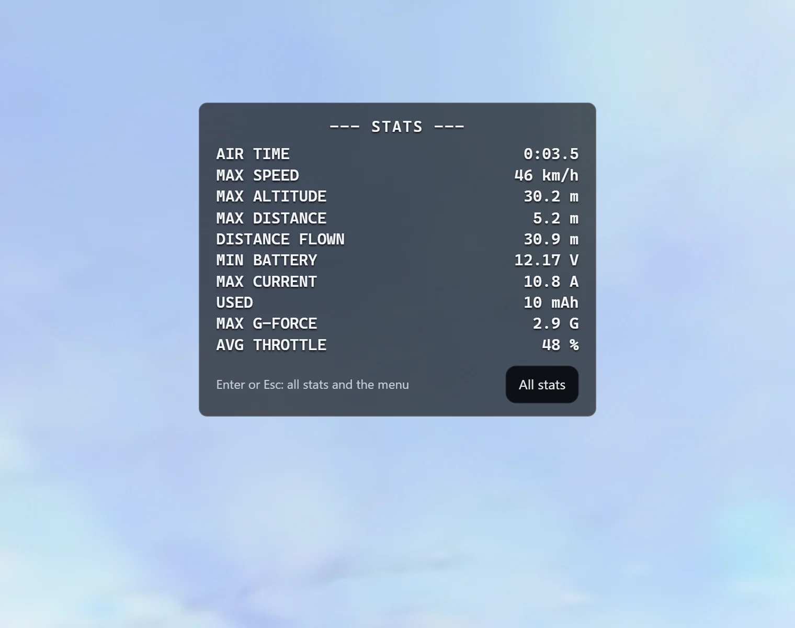
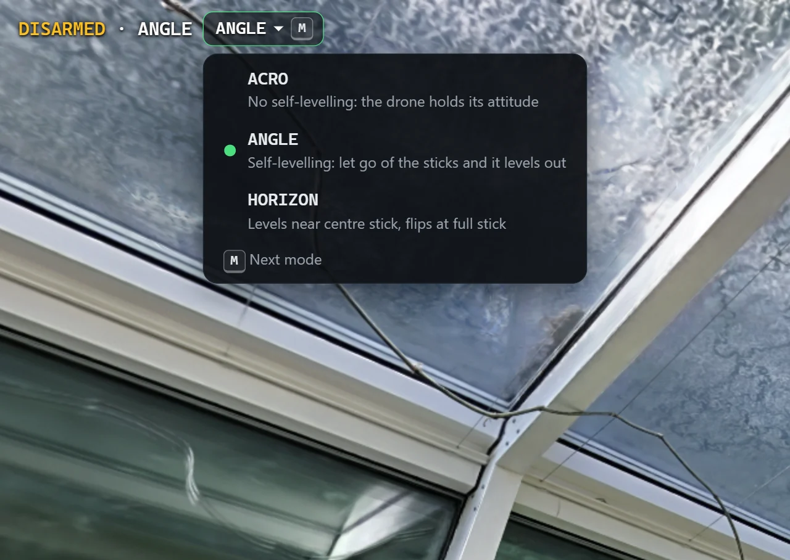
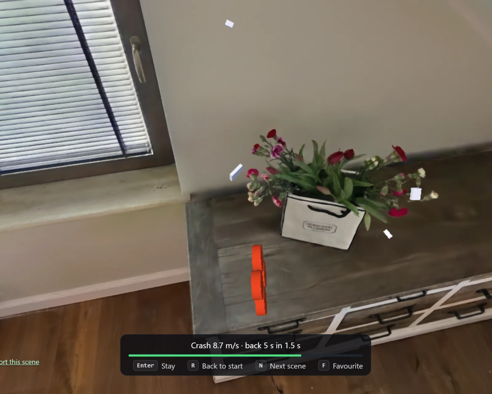
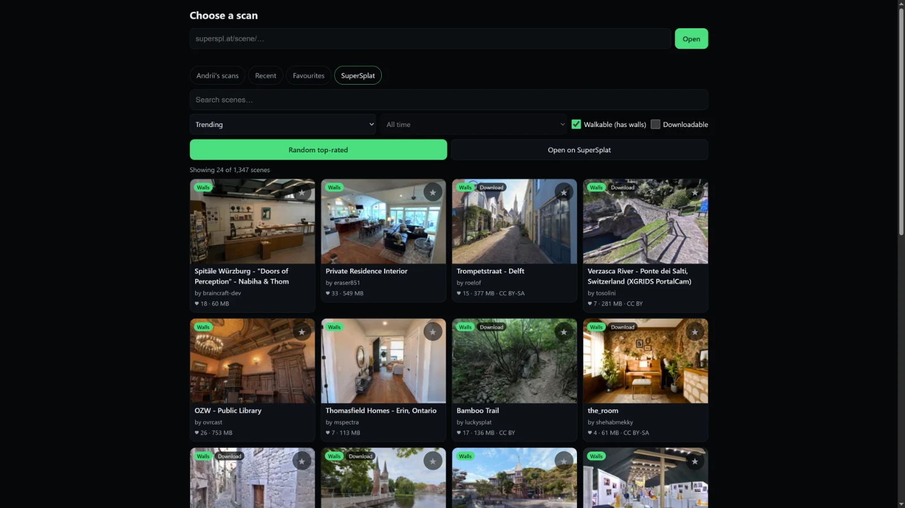
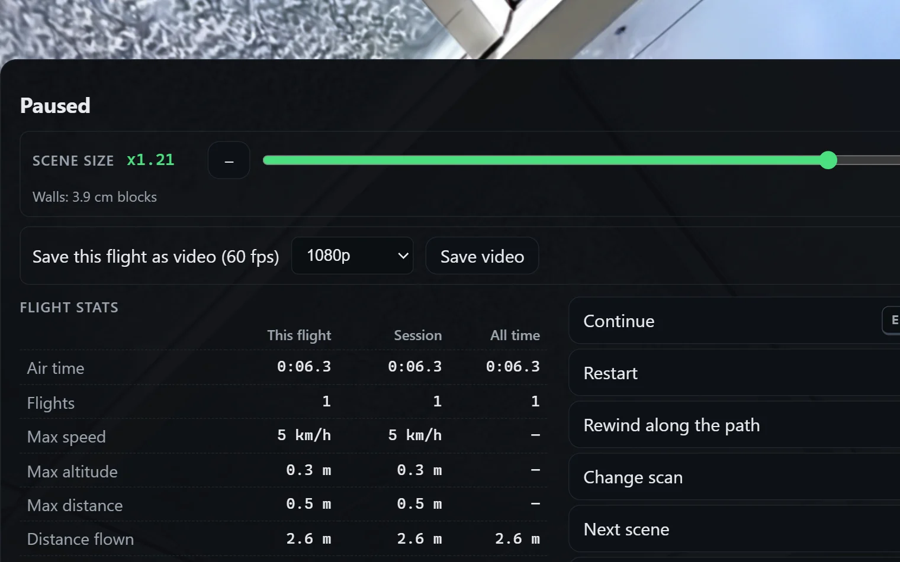
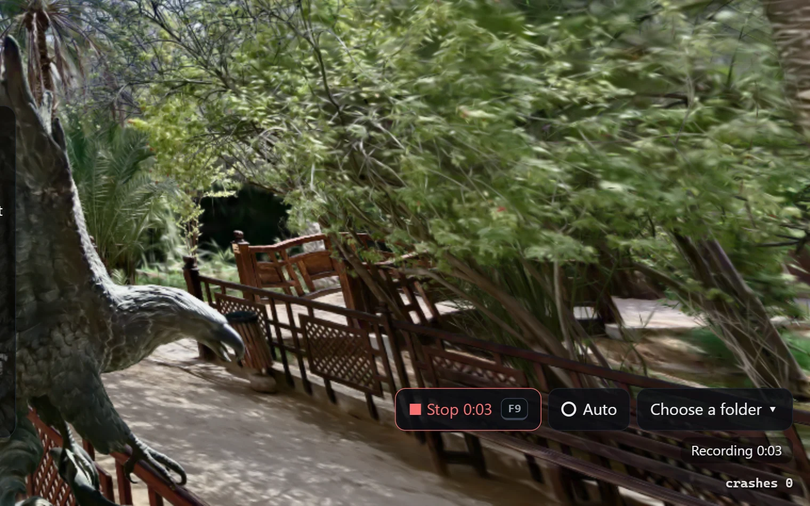
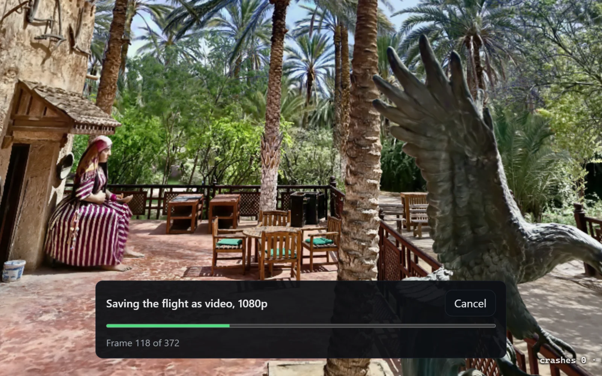
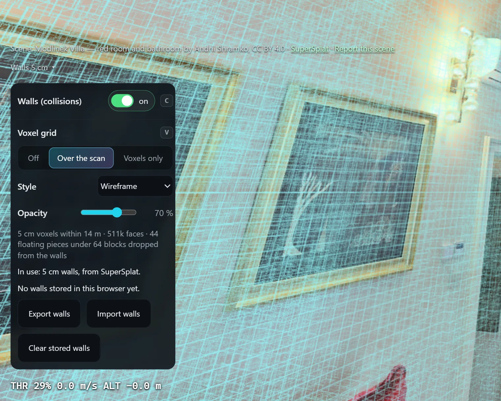

# ShramkoGSFPV — open-source FPV drone simulator for 3D Gaussian Splatting scenes

**Fly a real-feeling FPV drone through photoreal 3D Gaussian Splatting scans, right in your browser.** ShramkoGSFPV loads scenes straight from [SuperSplat](https://superspl.at), flies them with a quadcopter model that has four motors, a mixer, a rate PID and Betaflight-compatible rate curves, crashes you into real walls with swept voxel collision, and takes your own radio (EdgeTX over WebHID), a gamepad or touch sticks. WebGPU, the MIT-licensed PlayCanvas engine, nothing to install. Created by [Andrii Shramko](https://www.linkedin.com/in/andrii-shramko/).

### ▶ Fly now: **https://gsfpv.flyreelstudio.eu**

[](https://gsfpv.flyreelstudio.eu)

> **Status: alpha, live since September 2026.** The site, the simulator and the measurements below run in public. Every feature claim in this README is either **measured** (a JSON file in [`evidence/`](evidence/) with its method) or explicitly marked **not tested yet**. Most pass/fail checks also run a negative control, a deliberately broken case that must fail; where a check has none, or a weak one, the line says so. The radio path has been tested with a *simulated* EdgeTX radio, not yet with a real one.

## Screenshots

Real screenshots of the live simulator, taken on 2 October 2026 by [`tools/bench/src/screens.ts`](tools/bench/src/screens.ts) in system Chrome on a real GPU (1920×1080 at device scale 2, so the menus stay sharp). A menu is shown as itself with a little of the scene around it; click any picture for the whole screen. The calibration screens use the simulator's built-in simulated EdgeTX radio; the flights are flown by its test pilot or from the keyboard and frozen while really flying. All 39 screens, phone-sized ones included, are in [`docs/screenshots/`](docs/screenshots/) and on the [landing page](https://gsfpv.flyreelstudio.eu/en/#gallery).

<table>
<tr>
<td width="50%" valign="top"><a href="docs/screenshots/voxels.webp"></a><br><sub><b>Voxel grid over the scan</b> — The walls you crash into, drawn over Andrii's Tunis scan in height colours: V switches between off, over the scan and voxels only; the chip names the style and the voxel size.</sub></td>
<td width="50%" valign="top"><a href="docs/screenshots/voxels-only.webp"></a><br><sub><b>Voxels only</b> — The scan hidden and only its 5 cm walls left, as solid cubes (Modlinek Villa): fly the grid alone and see every surface you can hit.</sub></td>
</tr>
<tr>
<td width="50%" valign="top"><a href="docs/screenshots/flight-tunis.webp"></a><br><sub><b>Tunis old town</b> — The flight view on Andrii's Tunis scan: arm state and flight mode, battery voltage and flight time, throttle, speed, altitude and the keys.</sub></td>
<td width="50%" valign="top"><a href="docs/screenshots/wizard-throttle.webp"></a><br><sub><b>Throttle found</b> — Each stick is found by moving it: the wizard names the channel, offers Reverse and moves on when the stick is back.</sub></td>
</tr>
<tr>
<td width="50%" valign="top"><a href="docs/screenshots/pause.webp"></a><br><sub><b>Summary panel</b> — Pause shows this flight's stats beside the session and all-time ones, the scene size, saving as video, every menu item and every key.</sub></td>
<td width="50%" valign="top"><a href="docs/screenshots/settings.webp"></a><br><sub><b>Settings</b> — Every setting on one screen, by group and with search; here Crashes & respawn: crashes, threshold, automatic respawn, delay, where and how far back, the invisible platform.</sub></td>
</tr>
<tr>
<td width="50%" valign="top"><a href="docs/screenshots/stats-card.webp"></a><br><sub><b>Flight stats</b> — Disarm after a flight and a card like the goggles OSD shows air time, top speed and altitude, distance, battery, current, mAh used, G-force and average throttle.</sub></td>
<td width="50%" valign="top"><a href="docs/screenshots/mode-chip.webp"></a><br><sub><b>Flight mode</b> — Angle by default; the chip, M or a switch on your radio picks Acro, Angle or Horizon.</sub></td>
</tr>
<tr>
<td width="50%" valign="top"><a href="docs/screenshots/crash-toast.webp"></a><br><sub><b>Automatic respawn</b> — The toast counts down; 2 s after the crash the drone is back 5 s along its path, still armed. Enter stays, R goes to the start, N and F load another scene.</sub></td>
<td width="50%" valign="top"><a href="docs/screenshots/crash.webp"></a><br><sub><b>Crash</b> — With automatic respawn off, or after Enter: the impact speed, the wreck with debris, then rewind 5 s, back to the start, a 10-second replay, the flight log or another scene.</sub></td>
</tr>
<tr>
<td width="50%" valign="top"><a href="docs/screenshots/superspl.webp"></a><br><sub><b>SuperSplat tab</b> — superspl.at's catalogue in the picker with its sorting, time, walls and download filters, search, Random top-rated and a star for favourites.</sub></td>
<td width="50%" valign="top"><a href="docs/screenshots/scene-size.webp"></a><br><sub><b>Scene size</b> — A scan not in true metres? [ and ] scale it around the drone from 0.25× to 4×, kept for each scan; the walls' block size follows.</sub></td>
</tr>
<tr>
<td width="50%" valign="top"><a href="docs/screenshots/rec-bar.webp"></a><br><sub><b>Recording</b> — F9 records 60 fps video of Andrii's scans; Auto records every flight into the folder you choose, and the bar says what was saved where.</sub></td>
<td width="50%" valign="top"><a href="docs/screenshots/video-export.webp"></a><br><sub><b>Video from the flight log</b> — The flight rendered again from its log as 60 fps video at 1080p, 1440p or 4K, frame by frame; Cancel leaves no file.</sub></td>
</tr>
<tr>
<td width="50%" valign="top"><a href="docs/screenshots/voxels-dropped.webp"></a><br><sub><b>Floating pieces dropped</b> — Modlinek Villa with the pieces of its walls under 64 blocks removed: 44 phantom walls gone, for this scan only; the walls menu says what was dropped.</sub></td>
<td width="50%" valign="top"><a href="docs/screenshots/walls.webp"></a><br><sub><b>Walls on or off</b> — The walls line on the credit opens the walls menu: the walls (collisions) switch, the voxel grid and the stored walls. Here the walls are off (C): the drone flies through everything, no crashes.</sub></td>
</tr>
<tr>
<td width="50%" valign="top"><a href="docs/screenshots/drones.webp"></a><br><sub><b>Six drones</b> — BetaFPV-class presets with a rate curve each; every number says where it comes from: manufacturer, measured or estimate.</sub></td>
<td width="50%" valign="top"><a href="docs/screenshots/betaflight.webp"></a><br><sub><b>Betaflight import</b> — Paste a CLI diff and its rates and PID fly the quad; every setting the simulator does not use is listed (here a test diff).</sub></td>
</tr>
<tr>
<td width="50%" valign="top"><a href="docs/screenshots/keys.webp"></a><br><sub><b>Keyboard</b> — Every flying key on screen: Space arms, W and S throttle, A and D yaw, the arrows tilt, M self-levelling, V the voxel grid, C the walls.</sub></td>
<td width="50%" valign="top"><a href="docs/screenshots/cinema.webp"></a><br><sub><b>Cinema mode</b> — Full detail, automatic quality off, no HUD; Record saves an MP4 with the scan's credit in the picture.</sub></td>
</tr>
<tr>
<td width="50%" valign="top"><a href="docs/screenshots/voxels-wire.webp"></a><br><sub><b>Wireframe grid</b> — The Winter Garden's 3.2 cm walls as a wireframe over the scan: see where a wall really is before you fly the line.</sub></td>
<td width="50%" valign="top"><a href="docs/screenshots/voxels-floaters.webp"></a><br><sub><b>Floaters in red</b> — Pieces of the grid that touch nothing else and are smaller than 0.5 m³ turn red, so a phantom wall in the plants stands out.</sub></td>
</tr>
<tr>
<td width="50%" valign="top"><a href="docs/screenshots/flight-garden.webp"></a><br><sub><b>Winter Garden</b> — Glass roof, plants and furniture, with the walls SuperSplat publishes for this scan: 3.2 cm voxels you really crash into.</sub></td>
<td width="50%" valign="top"><a href="docs/screenshots/picker.webp"></a><br><sub><b>Choose a scan</b> — Andrii's scans, recent and favourite ones, filters for walls, type and flown, or a pasted SuperSplat link.</sub></td>
</tr>
</table>

---

## Why this exists

FPV pilots train in simulators like Liftoff or VelociDrone because the physics and stick response feel right, but those sims only fly the maps someone built for them. Meanwhile people publish thousands of real places as 3D Gaussian Splatting scans — rooms, villas, streets, whole city blocks — and you can only walk or orbit through them.

ShramkoGSFPV joins the two: pick a real scanned place, arm, and fly it with a drone that behaves like the one in your hands. Rehearse an indoor line before flying it for real, plan a cinematic shot in the actual location, or fly your own house on the Moon.

The default craft is a **BetaFPV Pavo20 Pro** class 2.2″ cinewhoop, with five more presets: Pavo20 Pro II on 3S and 4S, Pavo Pico, Meteor65 Pro and Air65. Most scans are rooms and streets, where a 5″ freestyle quad has no room to move. On each preset card the spec rows (thrust-to-weight, weight, wheelbase, motor, battery) say where the number comes from: manufacturer, independent measurement or estimate. The card's maximum rate (°/s) and hover-throttle figures do not carry a source label yet. The thrust-to-weight of three presets (Pavo20 Pro 3S, Pavo20 Pro II 3S, Pavo Pico 2S) was measured in the model and is within 0.4 % of the preset value (`b-fly-b9.json`); the other three are **not measured yet**.

## Features and roadmap

Status on 2 October 2026. **Live** means you can use it on https://gsfpv.flyreelstudio.eu today; **In progress** is being built now; **Next** is designed and queued. How each input device was tested is in [Radios and devices](#radios-and-devices), and the numbers behind the physics are in [What is measured](#what-is-measured-not-claimed). The same list, in four languages, is on the [landing page](https://gsfpv.flyreelstudio.eu/en/#features). The v0.3 items name the check that accepted them on the live site (JSON files in [`evidence/`](evidence/); the list is in [`evidence/2026-10-02/v03-release.json`](evidence/2026-10-02/v03-release.json)).

### Available now (48)

| Area | Feature | Status |
|---|---|---|
| Radio & calibration | EdgeTX radio over USB (WebHID) in Chrome or Edge | Live |
| Radio & calibration | Calibration with a drawn radio that shows which stick to move; each step waits until you really move it (`v03-wizard-auto-live.json`) | Live |
| Radio & calibration | Reverse any channel after calibration | Live |
| Radio & calibration | Recalibrate button in Controls | Live |
| Radio & calibration | A known radio reconnects by itself, and stays connected when you change scenes (`v03-scenes-live.json`) | Live |
| Radio & calibration | The flight-mode switch on your radio is found on the check screen, with no click (`v03-modes-live.json`, with the simulated radio) | Live |
| Controls & flight modes | Gamepad through the browser's Gamepad API (not tested on real hardware yet) | Live |
| Controls & flight modes | Touch sticks and an ARM button on a touch screen (tested in touch emulation only) | Live |
| Controls & flight modes | Keyboard, with every flying key shown on screen | Live |
| Controls & flight modes | Flight modes: Angle (self-levelling, the default for everyone), Horizon and Acro; `M`, the mode chip on screen or your radio's switch (`v03-modes-live.json`) | Live |
| Controls & flight modes | Close Controls with × or Esc; the summary panel shows every key | Live |
| Drone & tuning | Six BetaFPV-class presets: Pavo20 Pro 3S (default), Pavo20 Pro II 3S and 4S, Pavo Pico 2S, Meteor65 Pro 1S, Air65 1S | Live |
| Drone & tuning | Betaflight, Actual, KISS and Raceflight rate curves (set through the diff import), checked against Betaflight 4.5.1 (`a3-rates-vectors.json`) | Live |
| Drone & tuning | Import rates, PID and throttle curve from a Betaflight CLI `diff` / `diff all` (`d-bf-diff-import.json`) | Live |
| Drone & tuning | PID for each axis: P, I, D and F | Live |
| Drone & tuning | Motor spin-up time 8–30 ms and air drag 0.5–2× | Live |
| Gravity, crashes & respawn | Gravity: Earth and Moon (measured, `b-fly-b16.json`), Mars, zero-g and a custom value through the `?g=` link parameter (not tested yet) | Live |
| Gravity, crashes & respawn | On other worlds: same motors, keep thrust-to-weight or auto throttle (the last two not tested yet) | Live |
| Gravity, crashes & respawn | Crash threshold from 2 to 10 m/s, or crashes off: a wall only bounces you off (`v03-respawn.json`, R18) | Live |
| Gravity, crashes & respawn | After a crash the drone is back by itself in 2 s, 5 s back along your path and still armed; `R` the start, `Y` rewind 5 s, `Enter` keeps the wreck (`v03-respawn.json`, R23 and RR; `v03-enter-keeps-wreck.json`) | Live |
| Gravity, crashes & respawn | Start on an invisible pad at spawn height, motors on, until you lift off (`v03-respawn.json`, R16) | Live |
| Gravity, crashes & respawn | Upside down or wedged and not moving: the drone goes a few seconds back by itself (`v03-respawn.json`, R18: lying upside down with crashes off, back in the air by itself) | Live |
| Gravity, crashes & respawn | Replay the last 10 s after a crash; a list of replays (`b-fly-b15.json`) | Live |
| Camera, view & video | Camera field of view 70–150° and uptilt 0–50° | Live |
| Camera, view & video | Stable frame ↔ detail slider; quality steps down by itself when frames drop (`d-governor.json`) | Live |
| Camera, view & video | HUD on or off; F3 shows frame times | Live |
| Camera, view & video | Reduced motion: a calmer crash camera (not tested yet) | Live |
| Camera, view & video | Cinema mode: full detail and MP4 recording on the showcase scans (`d-cinema.json`) | Live |
| Camera, view & video | Recording at 60 fps with `F9` on Andrii's scans, or auto-record every flight into a folder you choose (`v03-rec-R1-live-w41.json`: 60.0 Hz, 0.7 % repeated frames; the browser's own folder picker was not driven by a bench) | Live |
| Camera, view & video | Video from the flight log on Andrii's scans, from the summary panel or the replays: 60 fps at 1080p, 1440p or 4K (`v03-export-E1.json`) | Live |
| Camera, view & video | Simulator in English, Spanish, Polish or Russian | Live |
| Scenes & SuperSplat | Any public SuperSplat scene in the current format, by link or id, re-published versions (v2, v3…) too; scenes in SuperSplat's older PLY format do not open yet | Live |
| Scenes & SuperSplat | Tabs: Andrii's scans, Recent, Favourites; filters for walls, type and flown | Live |
| Scenes & SuperSplat | A SuperSplat tab with superspl.at's filters and sorting, a random top-rated scene and a star for favourites (`v03-superspl-live.json`) | Live |
| Scenes & SuperSplat | Change scenes without reloading the page: `N` next, `Shift+N` random, `F` next favourite; the radio stays connected (`v03-scenes-live.json`) | Live |
| Scenes & SuperSplat | After a crash, the next scene instead of a respawn: from Andrii's list, your favourites or the scenes you flew (off by default; `v03-scenes-live.json`, S3) | Live |
| Scenes & SuperSplat | Scale a wrong-size scene around the drone with `[` and `]`, kept for each scan (`v03-scale.json`) | Live |
| Scenes & SuperSplat | Loading progress: stage, MB, speed, time left and retry | Live |
| Walls & voxel grid | Walls built in your browser for scans published without them, up to 4 M Gaussians (`c-bake.json`) | Live |
| Walls & voxel grid | Walls (collisions) on or off (`C`, the walls menu or Settings), remembered per scan; the admin default per scan is `"walls": "on" \| "off"` in [`apps/fly/public/showcase.json`](apps/fly/public/showcase.json). A flight log records the setting and replays with it ([`walls-switch.test.ts`](packages/collision/test/walls-switch.test.ts)) | Live |
| Walls & voxel grid | Drop the floating specks of a noisy scan that turn into invisible walls ("phantom walls"): pieces under N blocks, per scan; the admin default is `"dropFloaters"` in `showcase.json` (`v03-floaters.json`) | Live |
| Walls & voxel grid | Voxel grid over the scan or on its own with the scan hidden (`V`): solid cubes, wireframe, height colours or floaters in red, opacity per mode; faces and floaters checked against brute force with controls ([`packages/collision/test/`](packages/collision/test/)) | Live |
| Settings, stats & flight data | Every setting kept between visits, each drone with its own tune; export, import and reset one or all (`v03-prefs.json`) | Live |
| Settings, stats & flight data | A catalogue of every setting with its default, range and key: [Everything you can tune](#everything-you-can-tune), [`docs/settings.md`](docs/settings.md) and the [landing page](https://gsfpv.flyreelstudio.eu/en/#tune) | Live |
| Settings, stats & flight data | Flight stats when you disarm, like the goggles OSD (`v03-summary-live.json`) | Live |
| Settings, stats & flight data | Summary panel: this flight's stats, every menu item and every key (`v03-summary-live.json`) | Live |
| Settings, stats & flight data | Save the flight log; export the trajectory as CSV or JSON (CSV checked in `d-trajectory-export.json`, JSON not tested yet) | Live |
| Settings, stats & flight data | Measurements panel: display refresh, frame times, physics rate and the input in use (its report rate is not measured yet); copy the report as JSON | Live |

### In progress (1)

| Feature | Status |
|---|---|
| Pavo20 Pro and Pro II physics tuned against the real quads: the blackbox log tools and the Betaflight dump import are ready, waiting for logs from the real quads | In progress |

### Next (1)

| Feature | Status |
|---|---|
| Radio switches for respawn and rewind | Next |

Missing a setting you need? Suggest it through the [contact form](https://gsfpv.flyreelstudio.eu/en/#contact) or open an issue.

## Everything you can tune

<!-- settings:start -->
<!-- Generated by scripts/gen-catalog.ts from the settings schema; edit the schema or the dictionaries, not this block. -->
**46 settings in 10 groups, 26 keyboard keys, 6 drone presets and 4 rate-curve types**, generated from the simulator's own settings schema, so this list shows only what ships today. Every setting with its default, range, scope and key: [`docs/settings.md`](docs/settings.md); in English, Spanish, Polish and Russian on the [landing page](https://gsfpv.flyreelstudio.eu/en/#tune).

| Group | Settings |
|---|---|
| Flight (1) | Flight mode (`M`) |
| Crashes & respawn (10) | Crashes · Crash threshold 2–10 m/s · Respawn after a crash · Respawn delay 0.5–10 s · Respawn at · How far back 1–30 s · Invisible platform · Stay armed after a respawn · Reset when stuck · Fresh battery |
| Camera (2) | Camera field of view 70–150° · Camera uptilt 0–50° |
| Display (5) | Show HUD (`H`) · Stable frame ↔ detail 0–1 · Reduced motion · Frame stats (`F3`) · Language |
| Controls (1) | Stick mode |
| Drone & physics (9) | Drone · Gravity 0–30 m/s² · Thrust on other worlds · Thrust-to-weight 2–8 · Motor spin-up time 8–30 ms · Air drag 0.5–2× · Duct drag 0–1.5 1/s · Propeller inertia 0–3× · Motor idle 0–15 % |
| Tune (3) | PID gains (P / I / D / F) · Rates (stick curves) · Throttle curve |
| Scenes (5) | Next scene after a crash · Scenes to rotate through · Order · Include scenes without walls · Scene size (`[` `]`) |
| Walls and voxel grid (6) | Walls (collisions) (`C`) · Drop floating pieces under N blocks 0–64 blocks · Voxel grid (`V`) · Voxel style · Voxel opacity over the scan 0.05–1 · Voxel opacity, voxels only 0.05–1 |
| Recording (4) | Frame rate · Video size · Auto-record · New file every 1–30 min |

**Keyboard:** `Esc` `P` pause / resume · `R` back to the start · `Y` rewind 5 s · `Enter` keep the wreck (no automatic respawn) · `N` next scene · `Shift+N` random scene · `F` next favourite scene · `M` flight mode · `Space` arm / disarm (keyboard flying) · `V` voxel grid: off / over the scan / voxels only · `C` walls on / off for this scan · `H` show or hide the hud · `[` scene smaller · `]` scene larger · `F9` start or stop recording · `F3` frame times and delay · `O` settings. **Keyboard flying:** `Space` arm / disarm · `W` `S` throttle up / down, stays where you leave it · `A` `D` yaw: turn left / right · `↑` `↓` `←` `→` pitch and roll: tilt · `M` self-levelling (ANGLE) or ACRO.

**Can I turn off crashes in a browser FPV simulator?**
Yes. Switch **Crashes** off in Settings and a wall hit never ends the flight, so a beginner can keep flying.

**Does it have angle / self-level mode?**
Yes: Acro (rate mode), Angle (self-levelling) or Horizon (levels, flips allowed). The default is Angle (self-levelling); the HUD chip and the M key switch it.

**Does the drone respawn by itself after a crash?**
Yes: 2 s after a crash it is back in the air, 5 s before the crash, on an invisible platform. Both times are settings (0.5–10 s and 1–30 s).

**Can I change the FPV camera angle and field of view?**
Yes, for each drone separately: camera uptilt 0–50° and field of view 70–150° (20° and 115° on the default drone).

**Can I fly an FPV drone on the Moon or Mars?**
Yes: gravity is a setting (0–30 m/s²): Earth 9.81, Moon 1.62, Mars 3.72, zero-g or anything in between. **Thrust on other worlds** picks how the motors cope: Real (same motors), Keep thrust / weight or Auto throttle (stick centre hovers).

**Can I use my own Betaflight rates and PID in the simulator?**
Yes: paste `diff` or `diff all` from the Betaflight CLI. The rates (Betaflight, Actual, KISS or Raceflight curves), the PID and the throttle curve are set for the drone you fly; every drone keeps its own.

**How hard can I hit a wall before it counts as a crash?**
That is the **Crash threshold**: 2–10 m/s for each drone, 4 m/s by default. Slower touches slide along the wall.

**Can I fix a scan that has the wrong size?**
Yes: **Scene size** scales the scan around the drone (0.25×–4×) and is remembered for each scan.

**Can I see the collision walls of a Gaussian Splatting scan?**
Yes: the **Voxel grid** shows the voxels you crash into, over the scan or voxels only.

**Can I record 60 fps video of my flight?**
Yes: **Frame rate** is 30 fps or 60 fps, 60 fps by default.

<!-- settings:end -->

## What is measured (not claimed)

Numbers from the JSON files in [`evidence/2026-09-24/`](evidence/2026-09-24/) named in each row. The landing page's figures come from [`evidence/latest.json`](evidence/latest.json) (rates, tunnelling, clearance, latency), and its build fails if a number is missing.

| Check | Result | How |
|---|---|---|
| Rate curves vs Betaflight 4.5.1 | **1880 points, max error 0 °/s** in double precision | Betaflight's own `rc.c` compiled outside the repo with `float` promoted to `double`, vs our re-implementation; a float32 build differs by at most 6.3e-4 °/s ([`PROVENANCE`](docs/PROVENANCE.md)). A deliberately wrong curve (`x³` instead of `x⁵` in Actual) misses the vectors by up to 280 °/s, so they tell the curves apart (`a3-rates-vectors.json`) |
| Flying through walls (tunnelling) | **0 in 200,000 straight passes** | 1 ms swept test vs an independent resampling oracle at 5–34 m/s on 3 real scans and a 2 cm wall; the endpoint-only control misses walls, so the oracle is not blind (`a5-tunnelling.json`) |
| Determinism | **same SHA-256 of the whole trace** in Node and Chrome and at 30/60/144/240 Hz frame splits | `Math.random` injected into the core changes the hash (`a6-determinism.json`) |
| Replay from stick inputs only | **same hash in a new tab**; 1 LSB changed in one report → different hash and > 1 cm divergence | 30 s flight with a flip and a crash, on the live site (`b-fly-b15.json`) |
| Wall clearance, Pavo20 Pro | body stops **47.2 mm (median)** beyond its own size on 5 cm voxel collision | 200 directions from 12 points; a record, not a gate, so it has no negative control (`a8-clearance.json`) |
| Stick-to-screen latency | **display-limited**: the test screen runs at 30 Hz (median 252 ms, blank-page floor 65 ms) | `SendInput` → Desktop Duplication marker, N = 220, `lagFrames=2` control fires; camera measurement not done yet (`a9-latency.json`) |

## How it works

```
superspl.at link or id ──► CDN: settings.json, lod-meta.json, scene.voxel.{json,bin}
                                   │
┌──────────────┐   ┌───────────────┴──────┐   ┌──────────────────────┐
│ render        │   │ sim-core (no DOM)     │   │ input                 │
│ PlayCanvas    │◄──│ 1 ms fixed step, 4    │◄──│ WebHID (EdgeTX)       │
│ WebGPU, GPU   │   │ motors, mixer, rate   │   │ Gamepad API           │
│ sort, LOD     │   │ PID, BF/Actual/KISS/  │   │ touch sticks          │
│ streaming     │   │ Raceflight rates,     │   │ calibration wizard,   │
└──────────────┘   │ gravity, input log     │   │ arm gate              │
                   └──────────┬────────────┘   └──────────────────────┘
                              ▼
                   ┌──────────────────────┐   ┌──────────────────────┐
                   │ collision             │   │ crash                 │
                   │ voxel octree (vendored│──►│ Rapier wreck, debris,  │
                   │ MIT), swept spheres   │   │ chase camera, respawn  │
                   └──────────────────────┘   └──────────────────────┘
```

- **Scenes:** any public SuperSplat scene by link (`superspl.at/scene/<id>`, `superspl.at/s?id=<id>`) or id, loaded by the visitor's browser from the public CDN — the server never talks to SuperSplat. Scenes without collision data fly as "no walls" and say so (`b-fly-b6.json`, `b-fly-b7.json`).
- **Flight model:** own code, re-implemented from Betaflight's published formulas (no GPL code copied): motor lag, battery sag, drag, airmode, angle mode for beginners. Every constant carries its source. Checked in Node (`a4-physics.json`): hover, full-stick rates, motor lag, airmode at zero throttle, PID step response, drag (terminal velocity). Battery sag is only recorded as information (no pass/fail check); angle mode is **not tested yet**.
- **Crashes:** impact speed decides; the wreck tumbles with debris (Rapier), then the crash screen offers a respawn at the start or at the last safe point. `b-fly-b12.json` recorded one wall hit, 4 debris pieces and a respawn into free space; it does not record which of the two points was used. Crash effects stay under the WCAG limit of 3 flashes per second: at most **2 flashes per second** measured over 50 crashes, whole frame and quarters (`b-fly-b17.json`).
- **Gravity:** Earth, Moon, Mars, zero-g or your own value, with an honest "same motors" mode and a "keep thrust-to-weight" mode. Measured on the live site: disarmed drops on Earth (9.59 m/s² for 9.81) and the Moon (1.617 m/s² for 1.62) (`b-fly-b16.json`). That check has no real negative control yet: its control is a fixed flag in the harness, not a run that could fail. Mars, zero-g, a custom value and the "keep thrust-to-weight" mode are **not tested yet** in the app (zero-g is checked only in the Node core: angular momentum is conserved, `a4-physics.json`).
- **Replays:** only stick inputs are stored; the flight is recomputed bit-exactly (`b-fly-b15.json`).
- **Walls for scans published without them:** one click builds collision in the browser with SuperSplat's own tool and defaults (`@playcanvas/splat-transform`, 5 cm voxels). On a 2.1 M-Gaussian scan it takes about 25 s and the result is **byte-for-byte identical** to the command-line tool; scans above 4 M Gaussians are refused with the numbers (`c-bake.json`, which has no negative control of its own; 0 penetrations in 50,000 passes on the baked walls, with a control, `c-a5-baked.json`).
- **Cinema mode:** finest level of detail, automatic quality off, and a WebCodecs recorder (H.264 MP4) for the showcase scans, with the scene's credit burned into the picture (`d-cinema.json`: a 6 s, 179-frame test recording; the credit strip was checked on one frame, not frame by frame).
- **Quality governor:** when frames start missing the display's refresh, render scale and splat budget step down, and come back when the GPU has room again. Measured: render scale 1 → 0.5 under load and back to 1 (`d-governor.json`); the splat-budget step is **not measured yet**.
- **Your Betaflight settings:** paste `diff` or `diff all` from the Betaflight CLI (4.3–4.5, 2025.12) and the simulated drone gets your rates, PID and throttle curve; anything the simulator does not use is listed, anything ambiguous is refused with the reason. Checked on the live site for rates and PID with a 4.5.1 and a 4.4.3 diff written in the firmware's exact print format but with made-up values (`d-bf-diff-import.json`); the throttle curve, 4.3 and 2025.12 are covered by unit tests only, and diffs from real flight controllers are **not tested yet**.
- **Trajectory export:** CSV or JSON at 100 samples per second, straight from the flight model. The CSV was checked on a 12.6 s flight (1,256 rows): the 125 positions sampled every 0.1 s equal the flight recomputed from the input log exactly, and a one-row shift is caught (`d-trajectory-export.json`); the JSON export is **not tested yet**.

Architecture decisions and their reasons: [`docs/decisions.md`](docs/decisions.md). What can go wrong: [`docs/warnings.md`](docs/warnings.md). Where every piece of code came from: [`docs/PROVENANCE.md`](docs/PROVENANCE.md).

## Radios and devices

| Browser | Input | Status |
|---|---|---|
| Chrome, desktop | EdgeTX radio (RadioMaster, Jumper, …) as USB joystick over WebHID | tested in Chrome with a **simulated** EdgeTX radio; real radio not tested yet; Edge not run yet |
| Chrome / Edge, desktop | Gamepad, DJI controller as a gamepad | not tested on real hardware yet |
| Desktop Chrome, touch emulation | Touch sticks | tested only in emulation (375×812, 1024×768): the arm button, both sticks at once and the pause button work. Holding a hover was not checked (the craft sat 0.3–3.3 m above its hover target), and the check's negative control is not conclusive yet. Safari, iPad and Android browsers not tested yet |
| Firefox 155 (Playwright build) | Gamepad or touch sticks | the scene renders with WebGPU and the app offers a gamepad or touch sticks (flying there not tested yet); radios need Chrome or Edge (no WebHID) |

Have an EdgeTX radio? A short test report is the most useful contribution right now — open an issue.

## Questions people ask

**How can I fly an FPV drone through a 3D Gaussian Splatting scan?**
Open https://gsfpv.flyreelstudio.eu, pick one of the showcase scans or paste any public SuperSplat link, connect your radio, gamepad or touch sticks, arm and fly. No install, no account.

**Is there a free FPV simulator that runs in the browser?**
Yes — ShramkoGSFPV is free and MIT-licensed. It needs WebGPU, so desktop Chrome or Edge works best.

**Can I use my RadioMaster / EdgeTX radio in the browser?**
Yes: set the radio to USB Joystick mode, open the simulator in Chrome or Edge, and the calibration wizard maps sticks, inversion and the arm switch. It has been verified only in Chrome with a simulated EdgeTX radio (Edge not run yet); real-radio reports are welcome.

**Do I crash when I hit a wall, or fly through it?**
You crash. The drone's body is swept against the scan's voxel collision every 1 ms physics step, so even at 34 m/s it does not slip through a 2 cm wall: 0 penetrations in 50,000 passes at a 2 cm wall and in 150,000 more on three real scans.

**Is the flight physics like Betaflight?**
The rate curves match Betaflight 4.5.1's own code with 0 error at 1880 points when both are computed in double precision (a float32 build differs by at most 6.3e-4 °/s); the PID and filters follow Betaflight's structure and default gains. It is a simulator, not a certified replica.

**Can my AI agent set this up?**
Yes — see below.

## For your AI agent

Paste into Claude Code, Codex, Cursor or any coding agent:

```text
Set up ShramkoGSFPV for me by following
https://github.com/AndriiShramko/ShramkoGSFPV/blob/main/AGENT_SETUP.md exactly.
Install, run the checks, start the simulator locally and open it in Chrome.
Do not change any system settings; ask me only if a step needs my password or a physical action.
```

Rules for agents working in this repository: [`AGENTS.md`](AGENTS.md). Summary for language models: [`llms.txt`](llms.txt).

## Run it locally

```bash
git clone -c core.autocrlf=false https://github.com/AndriiShramko/ShramkoGSFPV.git
cd ShramkoGSFPV && corepack enable && pnpm install --frozen-lockfile
pnpm -r typecheck && pnpm vitest run
pnpm --filter @gsfpv/fly dev        # http://localhost:5190/fly/?scene=39e63ce9
```

Full steps, update and removal: [`AGENT_SETUP.md`](AGENT_SETUP.md).

## Contributing

Most useful now: real-radio test reports (EdgeTX version, radio model, RF on/off), measurements on other GPUs and high-refresh displays, and flight-model review from pilots. See [`CONTRIBUTING.md`](CONTRIBUTING.md) and [`SECURITY.md`](SECURITY.md).

## Author and collaboration

**Andrii Shramko** — FPV pilot and 3D/4D Gaussian Splatting specialist, author and maintainer of ShramkoGSFPV.

I am passionate about this idea, always open to interesting people and ready to help teams bring incredible projects to life. If you are an **FPV pilot, scanning studio, drone maker, simulator developer, 3DGS platform, researcher or investor** — let's talk about partnership, integration, licensing, sponsorship or funding. I am ready to assemble and lead a team around it.

- **LinkedIn:** https://www.linkedin.com/in/andrii-shramko/
- **Book a call:** https://calendar.app.google/Ff729HqGk4RpzPNDA
- **Email:** zmei116@gmail.com
- **GitHub:** https://github.com/AndriiShramko
- **Contact form:** https://gsfpv.flyreelstudio.eu/en/#contact

## License and credits

Code is released under the [MIT License](LICENSE) © 2026 Andrii Shramko. If you use this project, keep the copyright notice and please credit **Andrii Shramko** with a link to this repository; citation metadata is in [`CITATION.cff`](CITATION.cff).

Built on the MIT-licensed [PlayCanvas Engine](https://github.com/playcanvas/engine) and [SuperSplat viewer](https://github.com/playcanvas/supersplat-viewer) (collision code vendored, see [`NOTICE`](NOTICE)), [Rapier](https://rapier.rs) (Apache-2.0) for the wreck, and formulas read from [Betaflight](https://github.com/betaflight/betaflight) 4.5.1. Thanks to [SplatFPV](https://github.com/Rouf0x/splatfpv), an earlier browser experiment that proved the idea works. Scenes remain the property of their authors and are shown with their license and attribution; authors can ask for removal through the "Report this scene" link in the simulator.

Product names (SuperSplat, PlayCanvas, Betaflight, EdgeTX, RadioMaster, BetaFPV, Liftoff, VelociDrone, DJI) belong to their owners and are used only to describe compatibility. This project is not affiliated with or endorsed by any of them.
