# ShramkoGSFPV screenshots

Real screenshots of the live simulator at https://gsfpv.flyreelstudio.eu, taken on 2026-09-27 (the release built from commit `ac6b57e`) by [`tools/bench/src/screens.ts`](../../tools/bench/src/screens.ts) in system Chrome (desktop 1920×1080, phone-sized 390×844). The same files are on the [landing page](https://gsfpv.flyreelstudio.eu/en/#gallery) with captions in four languages. To take them again after a release: `npx tsx tools/bench/src/screens.ts`.

The calibration screens use the simulator's built-in simulated EdgeTX radio (`?simradio=raw`) and the flights are flown by its test pilot (`?simradio=scenario`), so the same screens can be taken again the same way after a release. This file is written by the same script.

## Desktop (21)

<table>
<tr>
<td width="50%" valign="top"> <b>Tunis old town</b> — The flight view on Andrii's Tunis scan: arm state and flight mode, battery voltage and flight time, throttle, speed, altitude and the keys.</td>
<td width="50%" valign="top"> <b>Modlinek Villa</b> — A 2.2-inch cinewhoop in a real attic room; the scan's credit and its walls line sit at the bottom left.</td>
</tr>
<tr>
<td width="50%" valign="top"> <b>Winter Garden</b> — Glass roof, plants and furniture, with the walls SuperSplat publishes for this scan: 3.2 cm voxels you really crash into.</td>
<td width="50%" valign="top"> <b>Choose a scan</b> — Andrii's scans, recent and favourite ones, filters for walls, type and flown, or a pasted SuperSplat link.</td>
</tr>
<tr>
<td width="50%" valign="top"> <b>Loading</b> — What is downloading, megabytes done and in total, the speed, and the scan and its walls counted apart.</td>
<td width="50%" valign="top"> <b>Controls</b> — A radio over USB (EdgeTX), a gamepad, touch sticks or the keyboard, each with a one-line hint.</td>
</tr>
<tr>
<td width="50%" valign="top"><a href="wizard-stir.webp">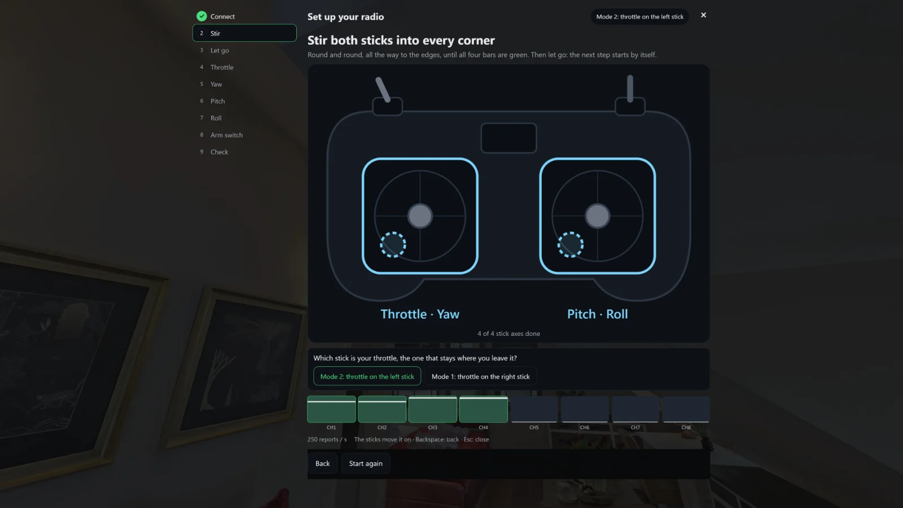</a> <b>Calibration: stir the sticks</b> — The drawn radio shows what to do, and the channel bars follow the reports (here a simulated EdgeTX radio).</td>
<td width="50%" valign="top"><a href="wizard-throttle.webp">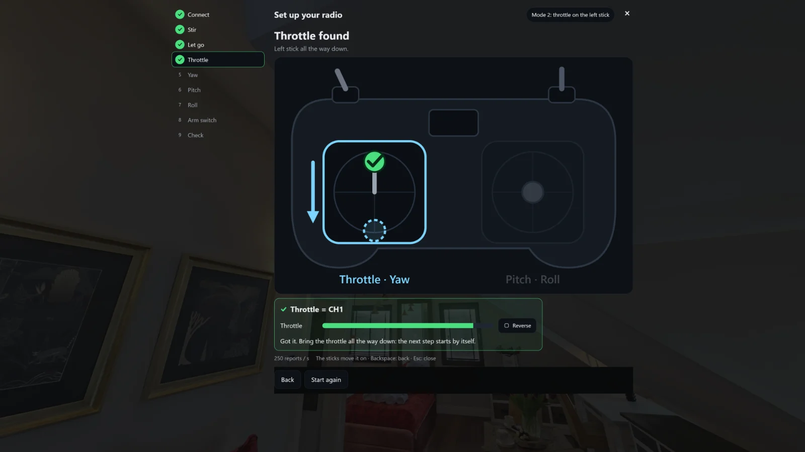</a> <b>Throttle found</b> — Each stick is found by moving it: the wizard names the channel, offers Reverse and moves on when the stick is back.</td>
</tr>
<tr>
<td width="50%" valign="top"><a href="wizard-arm.webp">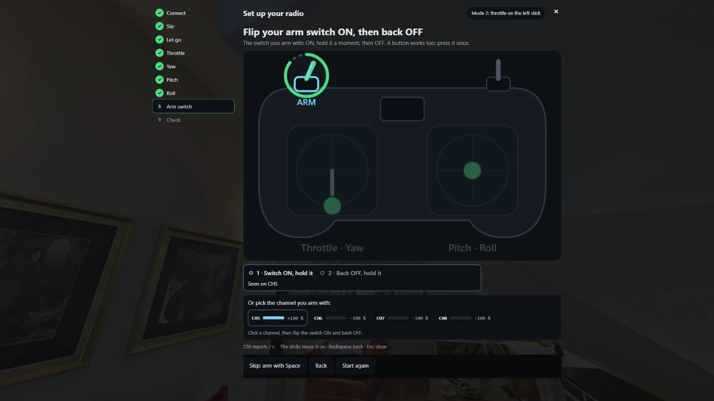</a> <b>Arm switch</b> — Flip the switch you arm with ON and back OFF, pick its channel, or skip the step and arm with Space.</td>
<td width="50%" valign="top"><a href="wizard-check.webp">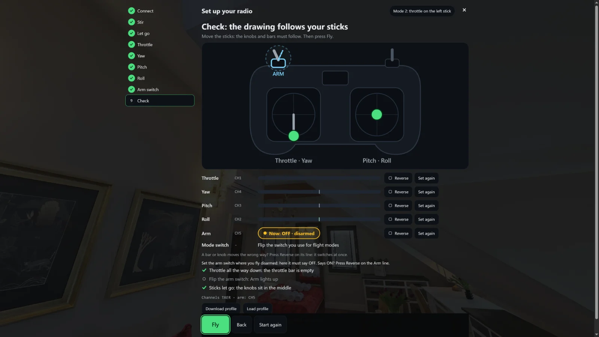</a> <b>Check before flying</b> — Every channel with a live bar and buttons to reverse or redo it, the arm state, and the profile to download or load.</td>
</tr>
<tr>
<td width="50%" valign="top"><a href="arm-card.webp">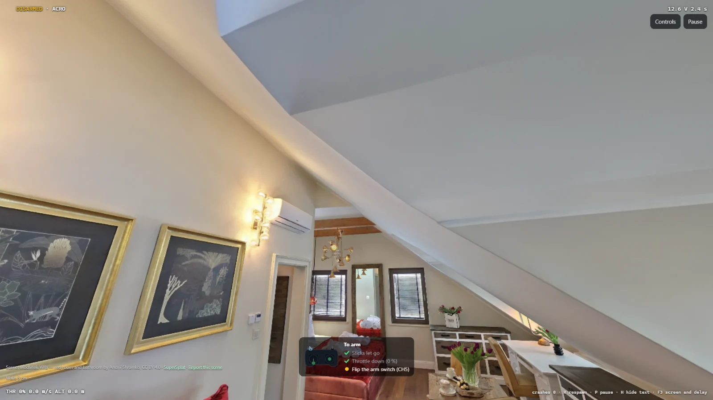</a> <b>Ready to arm</b> — Disarmed with a radio, a card lists what arming still needs: sticks let go, throttle down, the arm switch.</td>
<td width="50%" valign="top"><a href="keys.webp">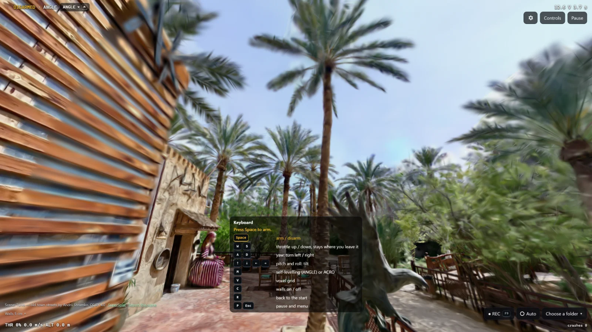</a> <b>Keyboard</b> — Every flying key on screen: Space arms, W and S throttle, A and D yaw, the arrows tilt, M switches self-levelling.</td>
</tr>
<tr>
<td width="50%" valign="top"><a href="walls.webp">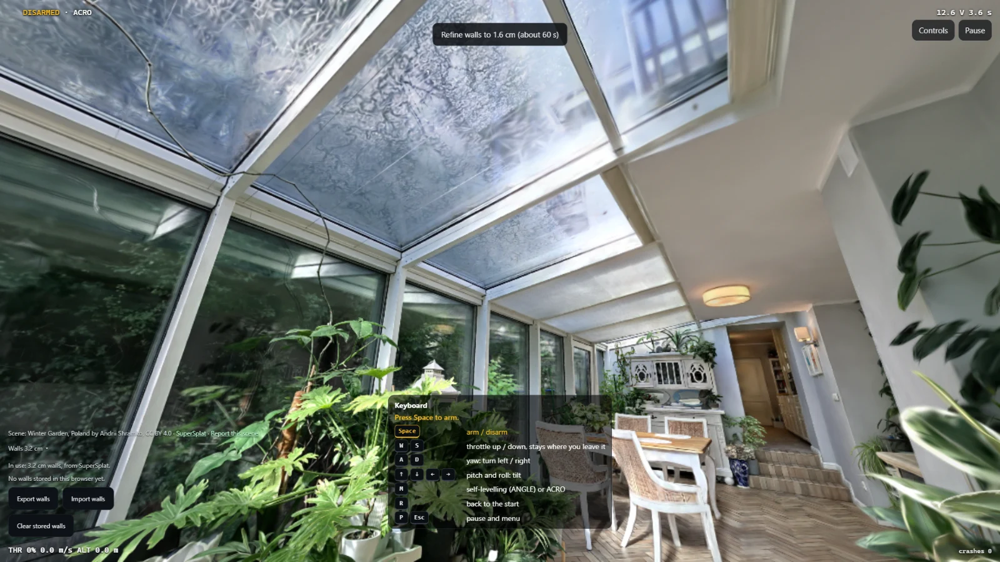</a> <b>Walls</b> — The walls line says which walls fly and offers finer ones with a time estimate; stored walls move to another PC as a zip.</td>
<td width="50%" valign="top"><a href="pause.webp">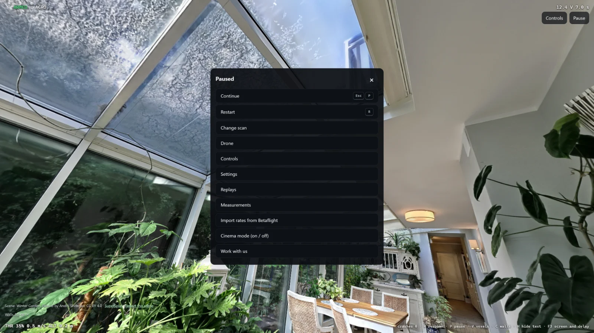</a> <b>Pause menu</b> — Continue, restart, scan, drone, controls, settings, replays, measurements, Betaflight import and cinema mode, with their keys.</td>
</tr>
<tr>
<td width="50%" valign="top"><a href="settings.webp">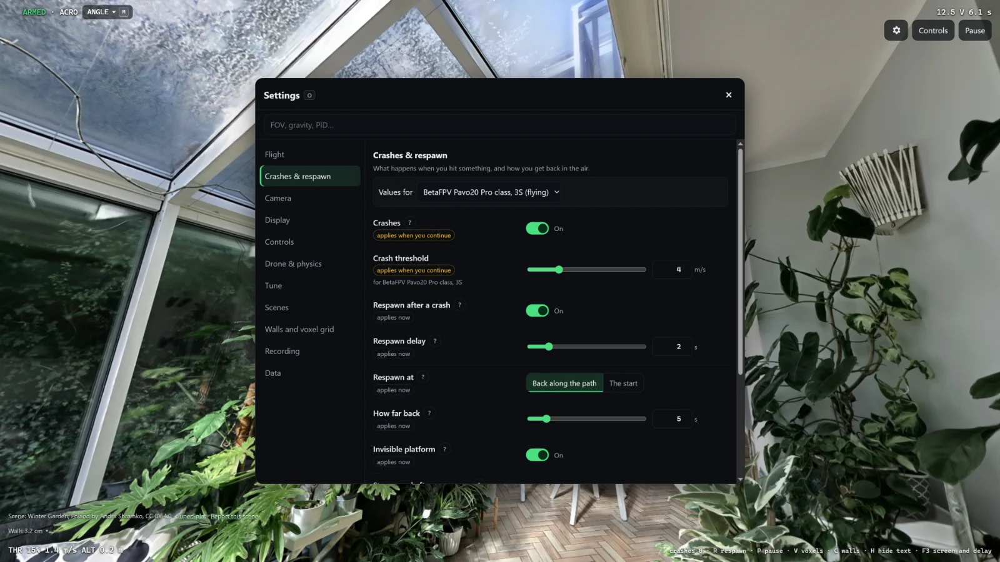</a> <b>Settings</b> — Field of view and uptilt, HUD, stable frame or detail, gravity, crash threshold, motor spin-up, drag and PID for each axis.</td>
<td width="50%" valign="top"><a href="drones.webp">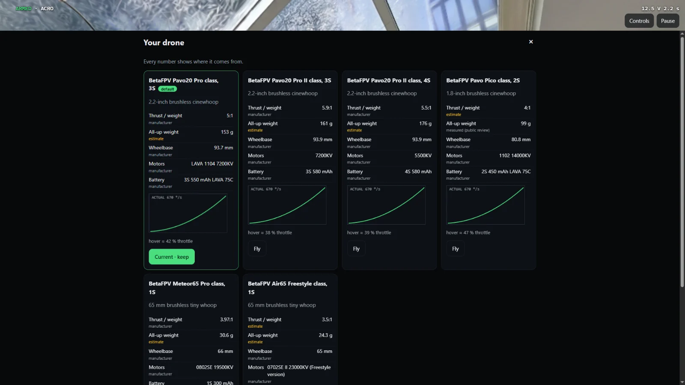</a> <b>Six drones</b> — BetaFPV-class presets with a rate curve each; every number says where it comes from: manufacturer, measured or estimate.</td>
</tr>
<tr>
<td width="50%" valign="top"><a href="betaflight.webp">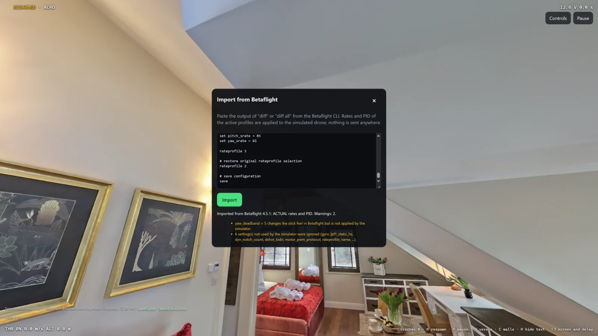</a> <b>Betaflight import</b> — Paste a CLI diff and its rates and PID fly the quad; every setting the simulator does not use is listed (here a test diff).</td>
<td width="50%" valign="top"><a href="measure.webp">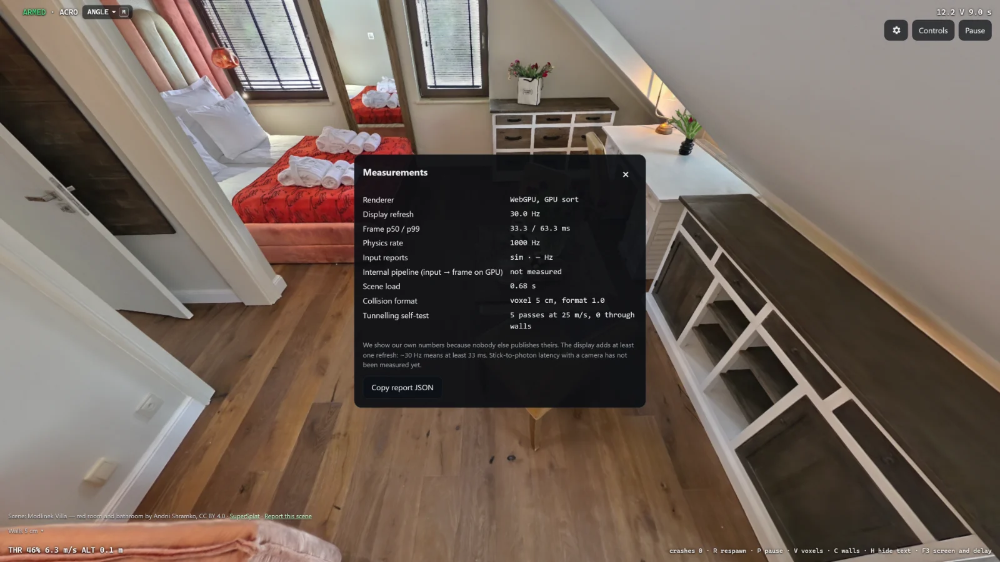</a> <b>Measurements</b> — Renderer, display refresh, frame times, physics rate, load time, the walls in use and a tunnelling self-test, copyable as JSON.</td>
</tr>
<tr>
<td width="50%" valign="top"> <b>Cinema mode</b> — Full detail, automatic quality off, no HUD; Record saves an MP4 with the scan's credit in the picture.</td>
<td width="50%" valign="top"><a href="crash.webp">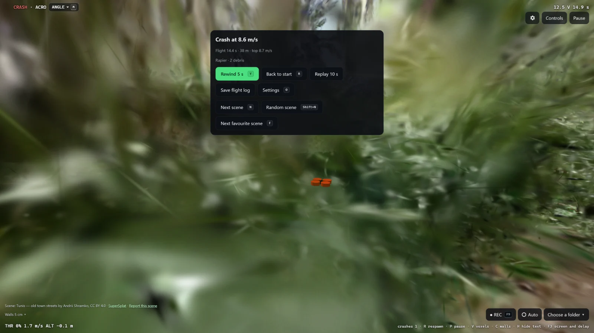</a> <b>Crash</b> — The impact speed decides; the wreck tumbles with debris, then respawn, a 10-second replay or the flight log.</td>
</tr>
<tr>
<td width="50%" valign="top"><a href="replays.webp">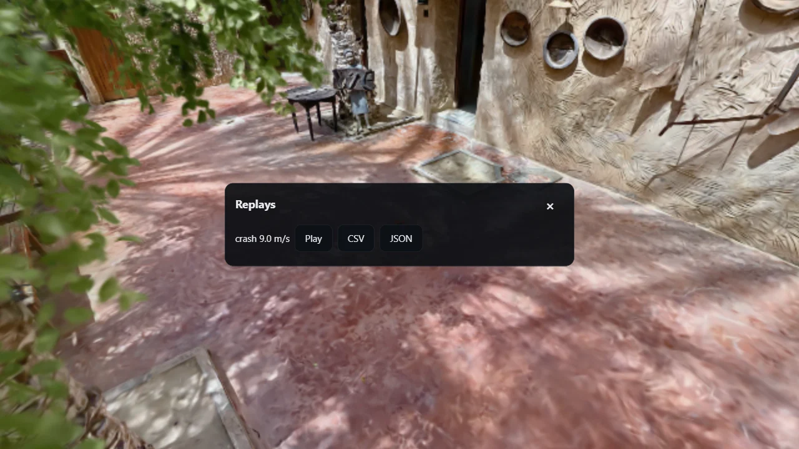</a> <b>Replays</b> — A saved flight plays again from its stick inputs alone; its trajectory exports as CSV or JSON.</td>
</tr>
</table>

## Phone-sized screen (5)

<table>
<tr>
<td width="50%" valign="top"> <b>Phone-sized screen</b> — The same flight view in portrait, 390 pixels wide.</td>
<td width="50%" valign="top"> <b>Touch sticks</b> — Two pads and an ARM button; on touch the quad flies self-levelling (ANGLE).</td>
</tr>
<tr>
<td width="50%" valign="top"> <b>Pause menu on a phone</b> — The whole menu fits on a phone screen.</td>
<td width="50%" valign="top"> <b>Crash on a phone</b> — Impact speed, debris and the crash panel on a small screen.</td>
</tr>
<tr>
<td width="50%" valign="top"> <b>Scans on a phone</b> — Paste a link or pick a scan on a small screen.</td>
</tr>
</table>
