# ShramkoGSFPV screenshots

Real screenshots of the simulator, taken on 2026-09-27 from a production build of commit `97294e0`, the release deployed to https://gsfpv.flyreelstudio.eu with these pictures, by [`tools/bench/src/screens.ts`](../../tools/bench/src/screens.ts) in system Chrome (desktop 1920×1080 at device scale 2, phone-sized 390×844). The same files are on the [landing page](https://gsfpv.flyreelstudio.eu/en/#gallery) with captions in four languages. To take them again after a release: `npx tsx tools/bench/src/screens.ts`.

Each menu has two files: `<name>-panel.webp` is the menu itself with a little of the scene around it (sharp enough to read), `<name>.webp` the whole screen. The calibration screens use the simulator's built-in simulated EdgeTX radio (`?simradio=raw`) and the flights are flown by its test pilot (`?simradio=scenario`), frozen while it is really flying, so the same screens can be taken again the same way after a release. This file is written by the same script.

## Desktop (25)

<table>
<tr>
<td width="50%" valign="top"> <b>Pause menu</b> — Continue, restart, scan, drone, controls, settings, replays, measurements, Betaflight import and cinema mode, with their keys. <a href="pause.webp">Whole screen</a>.</td>
<td width="50%" valign="top"> <b>Settings</b> — Field of view and uptilt, HUD, the walls and the voxel grid, stable frame or detail, gravity, crash threshold, motor spin-up, drag and PID for each axis. <a href="settings.webp">Whole screen</a>.</td>
</tr>
<tr>
<td width="50%" valign="top"> <b>Six drones</b> — BetaFPV-class presets with a rate curve each; every number says where it comes from: manufacturer, measured or estimate. <a href="drones.webp">Whole screen</a>.</td>
<td width="50%" valign="top"><a href="wizard-stir.webp">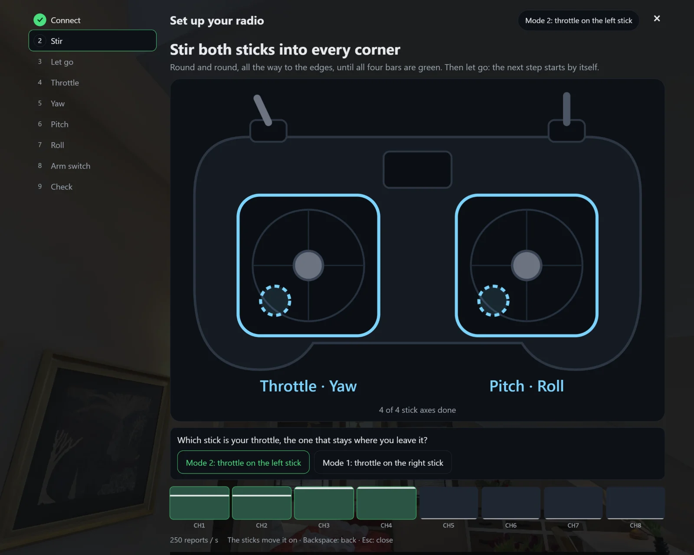</a> <b>Calibration: stir the sticks</b> — The drawn radio shows what to do, and the channel bars follow the reports (here a simulated EdgeTX radio). <a href="wizard-stir.webp">Whole screen</a>.</td>
</tr>
<tr>
<td width="50%" valign="top"> <b>Throttle found</b> — Each stick is found by moving it: the wizard names the channel, offers Reverse and moves on when the stick is back. <a href="wizard-throttle.webp">Whole screen</a>.</td>
<td width="50%" valign="top"><a href="wizard-arm.webp">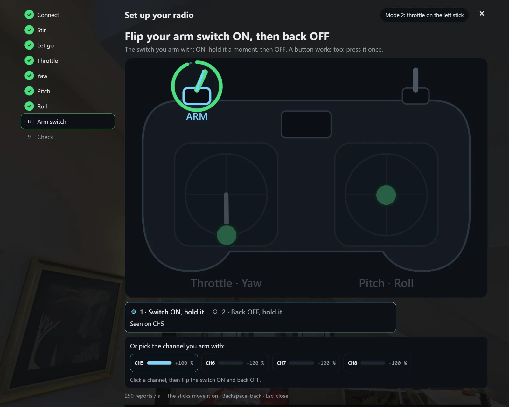</a> <b>Arm switch</b> — Flip the switch you arm with ON and back OFF, pick its channel, or skip the step and arm with Space. <a href="wizard-arm.webp">Whole screen</a>.</td>
</tr>
<tr>
<td width="50%" valign="top"><a href="wizard-check.webp">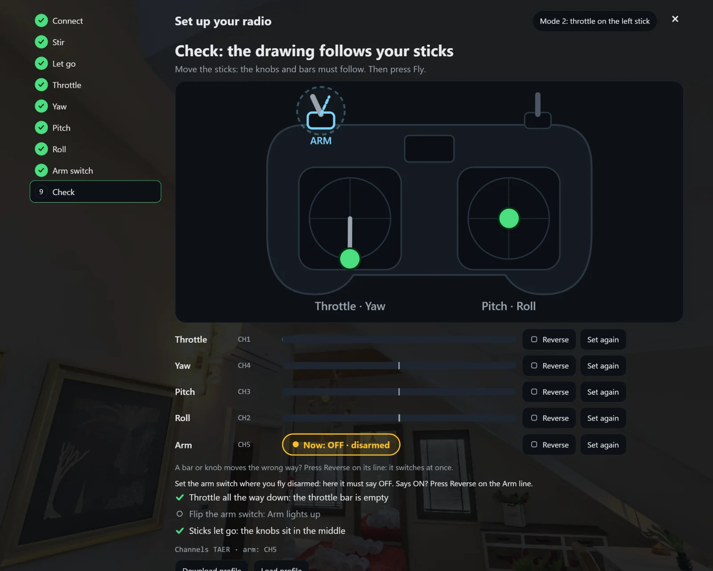</a> <b>Check before flying</b> — Every channel with a live bar and buttons to reverse or redo it, the arm state, and the profile to download or load. <a href="wizard-check.webp">Whole screen</a>.</td>
<td width="50%" valign="top"><a href="controls.webp">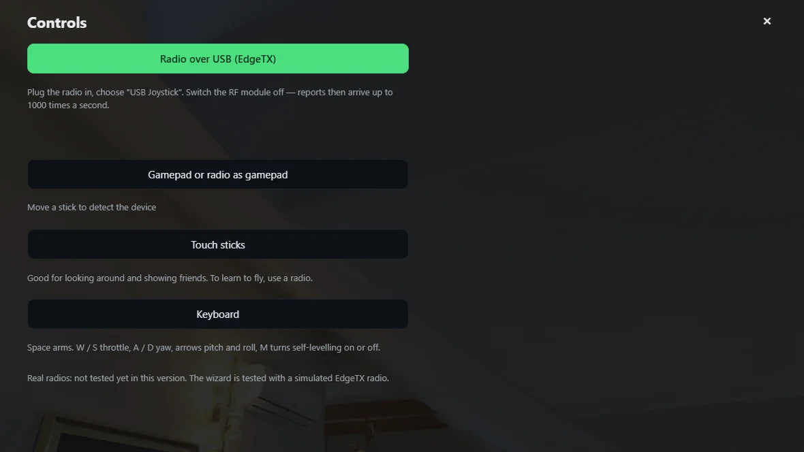</a> <b>Controls</b> — A radio over USB (EdgeTX), a gamepad, touch sticks or the keyboard, each with a one-line hint.</td>
</tr>
<tr>
<td width="50%" valign="top"><a href="arm-card.webp">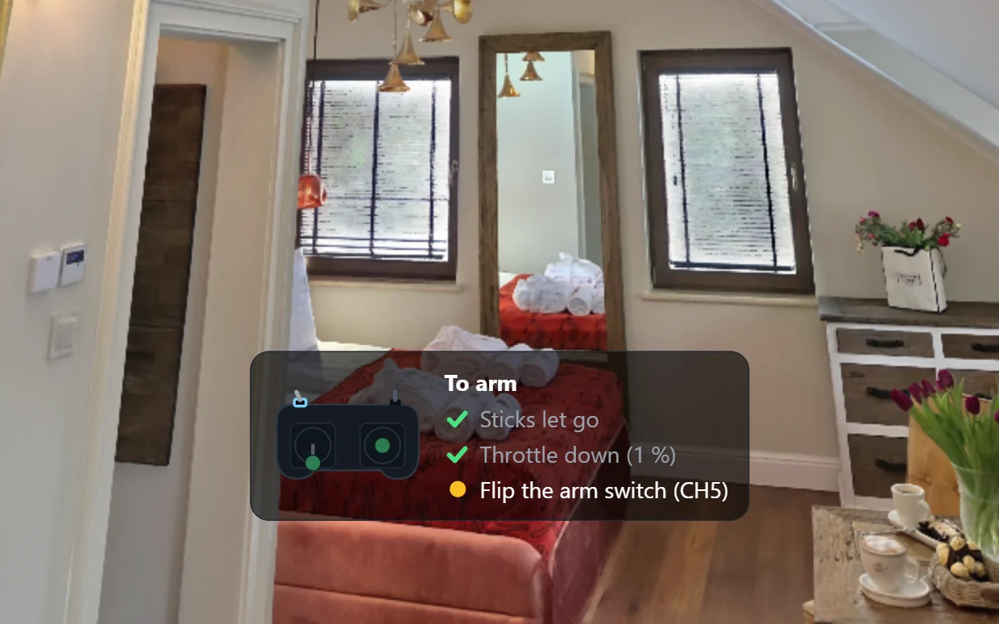</a> <b>Ready to arm</b> — Disarmed with a radio, a card lists what arming still needs: sticks let go, throttle down, the arm switch. <a href="arm-card.webp">Whole screen</a>.</td>
<td width="50%" valign="top"> <b>Keyboard</b> — Every flying key on screen: Space arms, W and S throttle, A and D yaw, the arrows tilt, M self-levelling, V the voxel grid, C the walls. <a href="keys.webp">Whole screen</a>.</td>
</tr>
<tr>
<td width="50%" valign="top"> <b>Walls on or off</b> — The walls line on the credit opens the walls menu: the walls (collisions) switch, the voxel grid and the stored walls. Here the walls are off (C): the drone flies through everything, no crashes. <a href="walls.webp">Whole screen</a>.</td>
<td width="50%" valign="top"> <b>Voxel grid over the scan</b> — The walls you crash into, drawn over Andrii's Tunis scan in height colours: V switches between off, over the scan and voxels only; the chip names the style and the voxel size.</td>
</tr>
<tr>
<td width="50%" valign="top"> <b>Wireframe grid</b> — The Winter Garden's 3.2 cm walls as a wireframe over the scan: see where a wall really is before you fly the line.</td>
<td width="50%" valign="top"> <b>Voxels only</b> — The scan hidden and only its 5 cm walls left, as solid cubes (Modlinek Villa): fly the grid alone and see every surface you can hit.</td>
</tr>
<tr>
<td width="50%" valign="top"> <b>Floaters in red</b> — Pieces of the grid that touch nothing else and are smaller than 0.5 m³ turn red, so a phantom wall in the plants stands out.</td>
<td width="50%" valign="top"> <b>Betaflight import</b> — Paste a CLI diff and its rates and PID fly the quad; every setting the simulator does not use is listed (here a test diff). <a href="betaflight.webp">Whole screen</a>.</td>
</tr>
<tr>
<td width="50%" valign="top"><a href="measure.webp">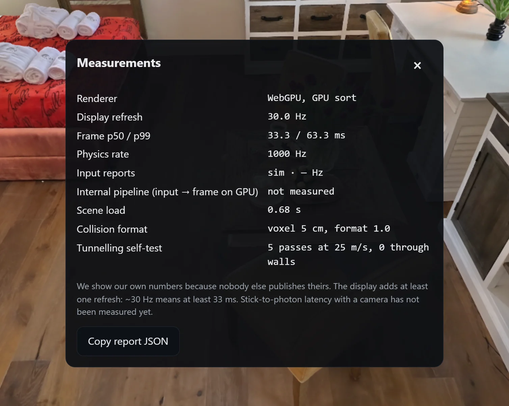</a> <b>Measurements</b> — Renderer, display refresh, frame times, physics rate, load time, the walls in use and a tunnelling self-test, copyable as JSON. <a href="measure.webp">Whole screen</a>.</td>
<td width="50%" valign="top"><a href="replays.webp">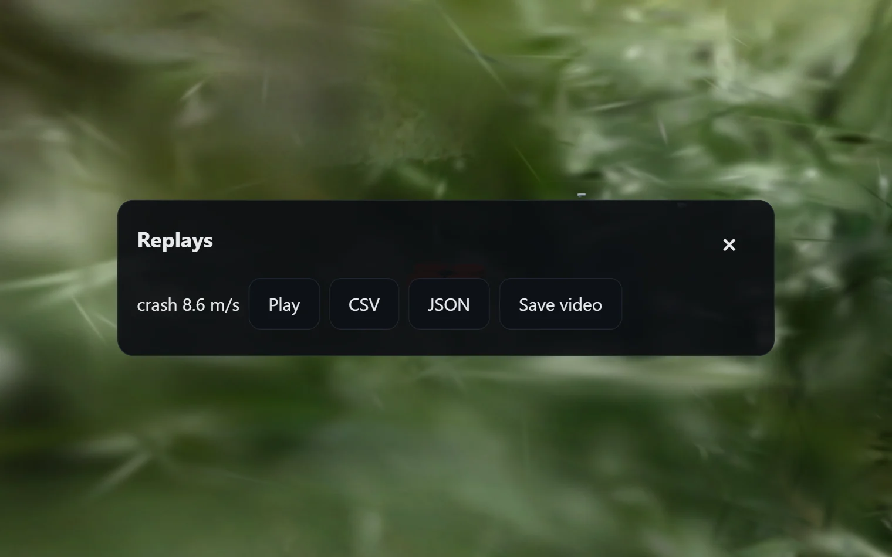</a> <b>Replays</b> — A saved flight plays again from its stick inputs alone; its trajectory exports as CSV or JSON. <a href="replays.webp">Whole screen</a>.</td>
</tr>
<tr>
<td width="50%" valign="top"> <b>Choose a scan</b> — Andrii's scans, recent and favourite ones, filters for walls, type and flown, or a pasted SuperSplat link.</td>
<td width="50%" valign="top"><a href="loading.webp">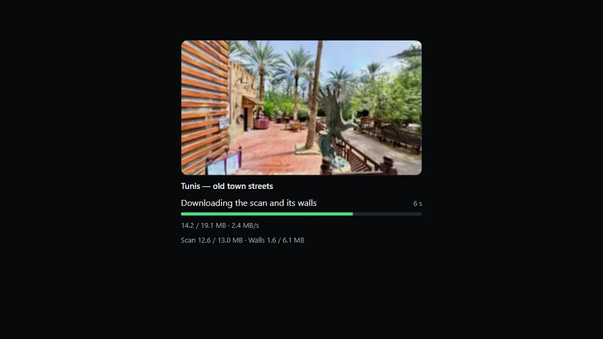</a> <b>Loading</b> — What is downloading, megabytes done and in total, the speed, and the scan and its walls counted apart.</td>
</tr>
<tr>
<td width="50%" valign="top"> <b>Crash</b> — The impact speed decides; the wreck tumbles with debris, then respawn, a 10-second replay or the flight log. <a href="crash.webp">Whole screen</a>.</td>
<td width="50%" valign="top"> <b>Cinema mode</b> — Full detail, automatic quality off, no HUD; Record saves an MP4 with the scan's credit in the picture.</td>
</tr>
<tr>
<td width="50%" valign="top"> <b>Tunis old town</b> — The flight view on Andrii's Tunis scan: arm state and flight mode, battery voltage and flight time, throttle, speed, altitude and the keys.</td>
<td width="50%" valign="top"><a href="flight-villa.webp">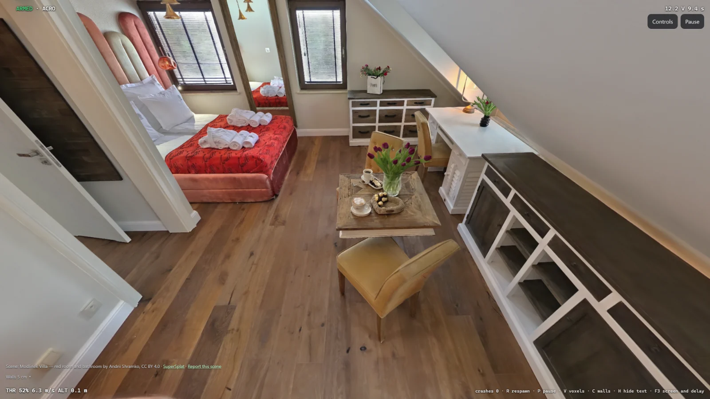</a> <b>Modlinek Villa</b> — A 2.2-inch cinewhoop in a real attic room; the scan's credit and its walls line sit at the bottom left.</td>
</tr>
<tr>
<td width="50%" valign="top"> <b>Winter Garden</b> — Glass roof, plants and furniture, with the walls SuperSplat publishes for this scan: 3.2 cm voxels you really crash into.</td>
</tr>
</table>

## Phone-sized screen (5)

<table>
<tr>
<td width="50%" valign="top"><a href="m-flight.webp">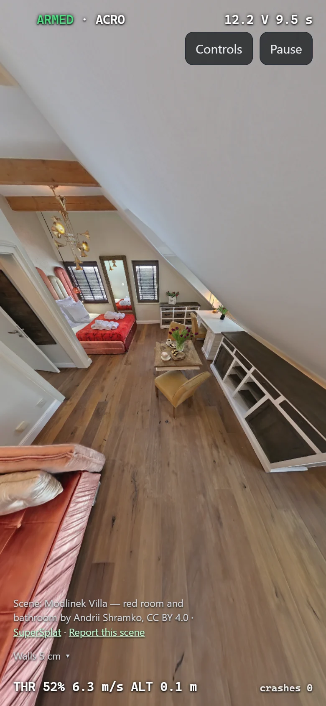</a> <b>Phone-sized screen</b> — The same flight view in portrait, 390 pixels wide.</td>
<td width="50%" valign="top"><a href="m-touch.webp">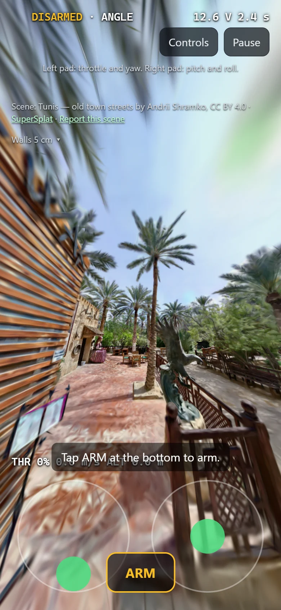</a> <b>Touch sticks</b> — Two pads and an ARM button; on touch the quad flies self-levelling (ANGLE).</td>
</tr>
<tr>
<td width="50%" valign="top"><a href="m-pause.webp">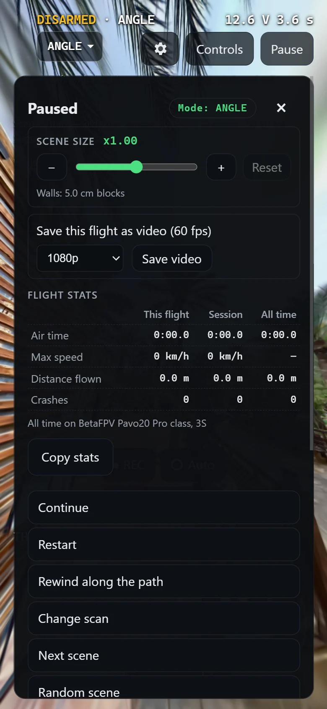</a> <b>Pause menu on a phone</b> — The whole menu fits on a phone screen.</td>
<td width="50%" valign="top"><a href="m-crash.webp">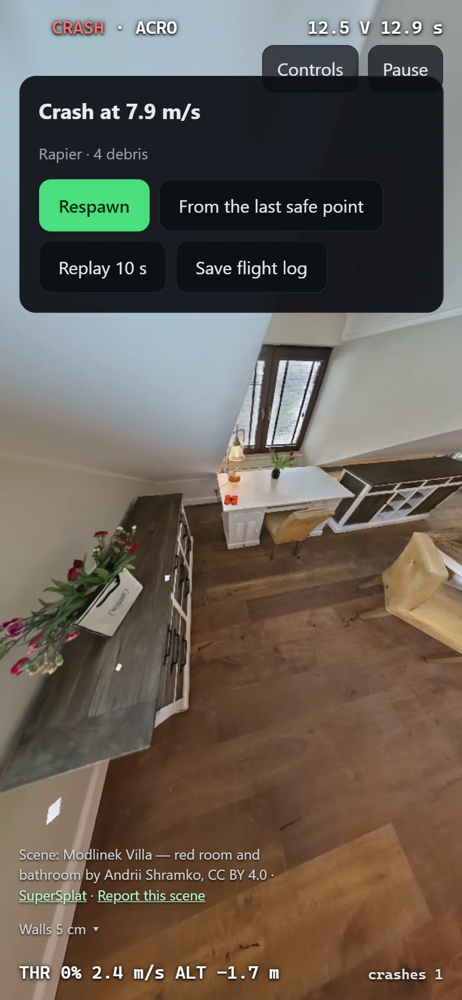</a> <b>Crash on a phone</b> — Impact speed, debris and the crash panel on a small screen.</td>
</tr>
<tr>
<td width="50%" valign="top"><a href="m-picker.webp">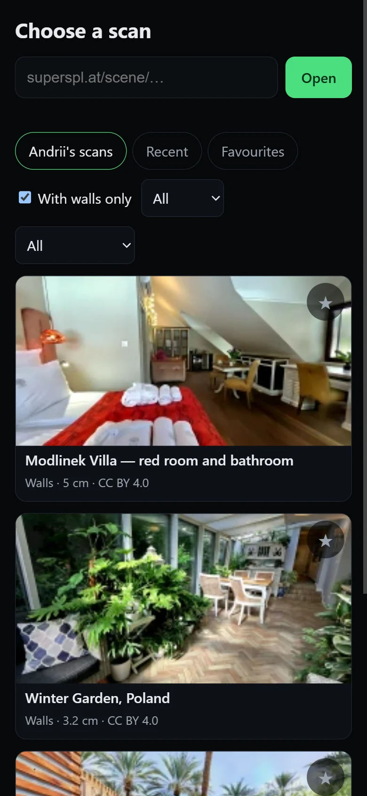</a> <b>Scans on a phone</b> — Paste a link or pick a scan on a small screen.</td>
</tr>
</table>
